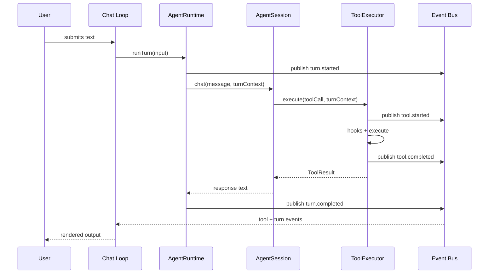

# Sonny architecture overview

Sonny is centered on a single interactive agent runtime. The CLI starts a chat session, the runtime composes the dependencies needed for a conversation, and the agent session coordinates model requests, tool execution, persistence, and compaction.

## Main runtime pieces

- `src/cli/main.ts` defines the `chat` command, creates the `InMemoryRuntimeEventBus`, and passes it to both the runtime and the UI.
- `src/cli/chat-loop.tsx` owns the Ink TUI, slash-command dispatch, message rendering, and tool approval UI; it subscribes to the event bus for real-time tool lifecycle updates.
- `src/runtime/create-agent-session.ts` assembles the working set: config, skills, history, LLM provider, tool registry, tool hooks, context manager, and event bus; constructs `AgentRuntime` to wrap `AgentSession`.
- `src/runtime/agent-runtime.ts` serializes turns per session, creates `TurnContext`, and emits turn lifecycle events (`turn.started`, `turn.completed`, `turn.failed`).
- `src/agent/agent-session.ts` is the core conversation engine; `chat()` accepts a `TurnContext` and passes it to `ToolExecutor.execute()`.
- `src/events/` defines the event system: `RuntimeEvent` types, `RuntimeEventBus` / `RuntimeEventPublisher` interfaces, `InMemoryRuntimeEventBus`, `TurnContext`, and `publishRuntimeEvent()`.
- `src/agent/session-state.ts` tracks the mutable message state for the active session.
- `src/history/history-store.ts` persists sessions and messages on disk.
- `src/tools/tool-executor.ts` enforces policy, approval, execution, and result transforms for tool calls; emits `tool.started` and `tool.completed` events via `publishRuntimeEvent()`.
- `src/context/context-manager.ts` estimates token usage and compacts history when needed.

## Runtime composition

`createAgentSession()` is the composition root. It loads skills, opens history under `<workspace>/.history`, selects a new/resumed/continued session, and then creates the LLM provider, default tool registry, approval/policy hooks, executor, token counter, summarizer, and context manager. It then wraps `AgentSession` in an `AgentRuntime` that owns turn serialization and event emission. The event bus is injected as a `RuntimeEventPublisher` (publish-only view) so the runtime can emit events but cannot subscribe to its own output. For a new session it loads `<workspace>/<agentsPath>/<defaultAgent>/AGENT.md`, builds a system prompt from agent instructions plus a skills catalog, and persists that prompt with the session; resumed sessions reuse the persisted prompt.

That choice matters because the runtime is intentionally assembled from small abstractions:

- the **event system** is isolated in `src/events/*`
- the **runtime orchestration** is isolated in `src/runtime/agent-runtime.ts`
- the **LLM provider** is isolated in `src/llm/*`
- the **tool system** is isolated in `src/tools/*`
- the **context system** is isolated in `src/context/*`
- the **history system** is isolated in `src/history/*`
- the **skills system** is isolated in `src/skills/*`

## Conversation flow

1. The user types in the CLI.
2. The chat loop handles slash commands first.
3. Regular chat input is sent to `AgentRuntime.runTurn()`, which creates a `TurnContext` and publishes `turn.started`.
4. `AgentRuntime` delegates to `AgentSession.chat(message, turnContext)`, which prepares a request using the current state and compaction rules.
5. The LLM may return tool calls.
6. Tool calls go through `ToolExecutor.execute(call, turnContext)`, which publishes `tool.started`, then applies policy, approval, execution, and result transforms before publishing `tool.completed`.
7. Successful messages are appended to history and can later be resumed.
8. `AgentRuntime` publishes `turn.completed` (or `turn.failed` on error).

Turns are serialized per session via a promise chain in `AgentRuntime`, preventing concurrent turns from interleaving. The TUI subscribes to the event bus (filtered by `sessionId`) and updates tool display in real time without coupling to the execution path.

The diagram above shows a single-turn lifecycle with one tool call. Events flow through the bus to the TUI; control flow returns synchronously through the call stack.

## Workspace customization

The runtime loads an agent definition from `<workspace>/<agentsPath>/<defaultAgent>/AGENT.md`. On a new session, it combines that instruction body with a deduplicated skills catalog discovered from `<workspace>/skills/**/SKILL.md`; the catalog exposes only names and descriptions, while `loadSkill` retrieves a valid skill’s full body on demand. Invalid skill files are skipped with warnings, and a missing skills directory is non-fatal. Because a new session persists its completed system prompt, later agent-definition or skill-catalog edits do not retroactively change resumed sessions.

Use `src/agents/agents-loader.ts`, `src/skills/load-skills.ts`, `src/skills/parse-skill.ts`, `src/skills/build-skills-prompt.ts`, and `src/tools/builtin/load-skill-tool.ts` when changing this path. It depends on the startup defaults described in [configuration and operations](../operations/configuration.md) and feeds the persisted session model described in [context and history](../data/context-and-history.md).

## Why the architecture is split this way

The recent history shows a progression from a simple chat loop toward a local-agent platform: persistence, slash commands, and two-stage compaction arrived before the scaffolding refactor; web search/read abstractions came next; the latest feature introduced an event-driven runtime layer with a typed event bus, `AgentRuntime` for turn serialization, and `TurnContext` for per-turn correlation. The current structure keeps behavior changeable without making the CLI or runtime monolithic. For example, adding a capability or approval policy primarily touches [tools and guardrails](../integrations/tools.md) and runtime wiring, not the chat loop itself. Changes to request size or conversation continuity instead depend on [context and history](../data/context-and-history.md).

## Source anchors

- `src/runtime/create-agent-session.ts`
- `src/runtime/agent-runtime.ts`
- `src/agent/agent-session.ts`
- `src/agent/session-state.ts`
- `src/events/runtime-event.ts`
- `src/events/event-bus.ts`
- `src/events/turn-context.ts`
- `src/history/history-store.ts`
- `src/tools/tool-executor.ts`
- `src/context/context-manager.ts`
- `src/cli/chat-loop.tsx`
- `src/cli/main.ts`
