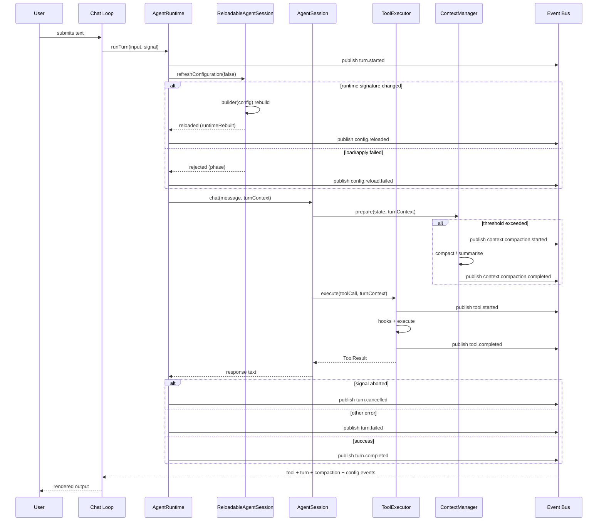

# Sonny architecture overview

Sonny is centered on a single interactive agent runtime. The CLI starts a chat session, the runtime composes the dependencies needed for a conversation, and the agent session coordinates model requests, tool execution, persistence, and compaction.

## Main runtime pieces

- `src/cli/main.ts` defines `main()`, which opens the `ConfigStore` before parsing arguments, registers the `chat` command (with `--resume`/`--continue`), creates the `InMemoryRuntimeEventBus`, and passes both the `configStore` and event bus into the runtime and the UI. Startup failures surface through a centralized `main().catch()`.
- `src/cli/chat-loop.tsx` owns the Ink TUI, slash-command dispatch, message rendering, and tool approval UI; it subscribes to the event bus for real-time tool lifecycle updates and config-reload notices, and runs a 5-second `config-poll` interval that asks the runtime to refresh configuration.
- `src/runtime/create-agent-session.ts` assembles the working set from a `RuntimeConfigStore`: it calls `configStore.refresh()` first, uses the resulting snapshot to locate skills/history/agent definition, defines a `buildSession: AgentSessionBuilder` factory that constructs the LLM provider, tool registry, hooks, executor, token counter, summarizer, and context manager for a given config, and wraps that factory's first build in a `ReloadableAgentSession` before constructing `AgentRuntime`.
- `src/runtime/agent-runtime.ts` serializes turns per session, creates `TurnContext` (carrying an `AbortSignal` for cancellation), refreshes configuration before each turn and each `/compact`, emits turn lifecycle events (`turn.started`, `turn.completed`, `turn.failed`, `turn.cancelled`), and emits config-reload events (`config.reloaded`, `config.reload.failed`) through a private `refreshConfiguration()` helper.
- `src/runtime/reloadable-agent-session.ts` is the hot-reload layer: `ReloadableAgentSession` implements `ConfigurableAgentRuntimeSession`, delegates `chat`/`getMessageCount`/`getContextUsage`/`compactContext` to the active built session, and `refreshConfiguration({ force })` decides whether to advance the snapshot only or rebuild the live runtime.
- `src/agent/agent-session.ts` is the core conversation engine; `chat()` accepts a `TurnContext` and passes it to `ToolExecutor.execute()`. It checks the abort signal at each LLM iteration and before each tool execution, stopping the turn at the next checkpoint.
- `src/events/` defines the event system: `RuntimeEvent` types (including `turn.cancelled`, `context.compaction.started` / `context.compaction.completed`, and `config.reloaded` / `config.reload.failed`), `RuntimeEventBus` / `RuntimeEventPublisher` interfaces, `InMemoryRuntimeEventBus`, `TurnContext` (with optional `AbortSignal`), and `publishRuntimeEvent()`.
- `src/agent/session-state.ts` tracks the mutable message state for the active session.
- `src/history/history-store.ts` persists sessions and messages on disk.
- `src/tools/tool-executor.ts` enforces policy, approval, execution, and result transforms for tool calls; emits `tool.started` and `tool.completed` events via `publishRuntimeEvent()`.
- `src/context/context-manager.ts` estimates token usage and compacts history when needed; publishes `context.compaction.started` / `context.compaction.completed` events through the `TurnContext`.
- `src/ui/` is the TUI presentation layer, rebuilt around the Mulberry design system: pure-logic modules (`theme.ts`, `markdown.ts`, `text-input.ts`, `key-router.ts`, `tool-row.ts`, `transcript.ts`, `context-meter.ts`, `approval.ts`, `command-popup.ts`) and declarative Ink components in `src/ui/components/`. The TUI subscribes to the event bus and renders tool outcomes, turn status, and compaction progress from runtime events rather than inferring them from content.

## Runtime composition

`createAgentSession()` is the composition root. It first calls `configStore.refresh()` (logging and continuing if the initial load was rejected), takes the current `ConfigSnapshot`, loads skills under `<workspace>/skills`, opens history under `<workspace>/.history`, selects a new/resumed/continued session, and then defines a `buildSession: AgentSessionBuilder` factory. That factory constructs the LLM provider, default tool registry, approval/policy hooks, executor, token counter, summarizer, and context manager for a given `ResolvedConfig`. The first factory result is wrapped in a `ReloadableAgentSession` (which holds the `configStore`, the builder, the applied snapshot, and the active built session), and `AgentRuntime` wraps that reloadable session and owns turn serialization and event emission. The event bus is injected as a `RuntimeEventPublisher` (publish-only view) so the runtime can emit events but cannot subscribe to its own output. For a new session it loads `<workspace>/<agentsPath>/<defaultAgent>/AGENT.md`, builds a system prompt from agent instructions plus a skills catalog, and persists that prompt with the session; resumed sessions reuse the persisted prompt.

That choice matters because the runtime is intentionally assembled from small abstractions:

- the **configuration store** is isolated in `src/config/*` (see [configuration and operations](../operations/configuration.md))
- the **hot-reload wrapper** is isolated in `src/runtime/reloadable-agent-session.ts` + `src/runtime/runtime-config-signature.ts`
- the **runtime orchestration** is isolated in `src/runtime/agent-runtime.ts`
- the **event system** is isolated in `src/events/*`
- the **TUI presentation layer** is isolated in `src/ui/*`
- the **LLM provider** is isolated in `src/llm/*`
- the **tool system** is isolated in `src/tools/*`
- the **context system** is isolated in `src/context/*`
- the **history system** is isolated in `src/history/*`
- the **skills system** is isolated in `src/skills/*`

## Conversation flow

1. The user types in the CLI.
2. The chat loop handles slash commands first. `/reload` forces a config refresh (source `reload`); other commands run as before.
3. Regular chat input is sent to `AgentRuntime.runTurn()` (which receives an `AbortSignal` from the UI), creates a `TurnContext` carrying that signal, and publishes `turn.started`.
4. `AgentRuntime` calls `refreshConfiguration(false, turnContext)` before delegating to the session. This refreshes from the `ConfigStore` and, if the runtime signature changed, rebuilds the live session atomically through the builder; reloads and reload failures are published as `config.reloaded` / `config.reload.failed` events.
5. `AgentRuntime` delegates to `AgentSession.chat(message, turnContext)`, which prepares a request using the current state and compaction rules.
6. Before each LLM iteration, the session checks `turnContext.signal`; if aborted, it records synthetic "denied" results for any pending tool calls (so the conversation stays API-valid) and throws. The signal is also passed to `llm.chat()` so in-flight HTTP requests can be aborted.
7. The LLM may return tool calls.
8. Tool calls go through `ToolExecutor.execute(call, turnContext)`, which publishes `tool.started`, then applies policy, approval, execution, and result transforms before publishing `tool.completed`.
9. If the context manager detects the token threshold is exceeded, it publishes `context.compaction.started`, runs compaction (trimming oversized tool results and/or summarizing the middle of the conversation), then publishes `context.compaction.completed` with before/after token counts and metrics.
10. Successful messages are appended to history and can later be resumed.
11. `AgentRuntime` publishes `turn.completed` (or `turn.cancelled` if the abort signal fired, or `turn.failed` on other errors).

Turns are serialized per session via a promise chain in `AgentRuntime`, preventing concurrent turns from interleaving. `/compact` and `reloadConfiguration` share the same queue, so a config refresh or manual `/reload` cannot overlap a running turn. The TUI subscribes to the event bus (filtered by `sessionId`) and updates tool display and config-reload notices in real time without coupling to the execution path.

The diagram above shows a single-turn lifecycle with one tool call and a preceding config refresh. Events flow through the bus to the TUI; control flow returns synchronously through the call stack.

## Configuration hot reload

`ReloadableAgentSession` (`src/runtime/reloadable-agent-session.ts`) lets the runtime adopt config edits without restarting. Its lifecycle, from a `refreshConfiguration({ force })` call:

1. Ask the `RuntimeConfigStore` (`ConfigStore`) to `refresh()`. If `refresh` returns `rejected`, return `{ status: "rejected", retainedRevision, phase: "load", error }` without touching the active session.
2. If the candidate revision equals the applied revision, return `unchanged`.
3. Compute `diffConfigSections()` between the applied and candidate config, and `createRuntimeConfigSignature()` (`src/runtime/runtime-config-signature.ts`) over the live runtime-affecting fields: `llm` (`model`, `apiKey`, `temperature`, `maxTokens`, `reasoningEffort`), `contextCompaction`, and `web.tavilyApiKey`. Session defaults (`workspace`, `agentsPath`, `defaultAgent`) are deliberately excluded because they only affect future sessions.
4. If the signature is unchanged, advance the applied snapshot only and return `{ status: "reloaded", runtimeRebuilt: false }` — future sessions pick up the new defaults, the live session keeps running.
5. If the signature changed and this revision was already rejected without `force`, return `unchanged` to avoid retry storms.
6. Otherwise call the `AgentSessionBuilder` to build a replacement session from the candidate config; on success swap `active` in and return `{ status: "reloaded", runtimeRebuilt: true, info }`. On a builder failure, retain the active session, record `rejectedApplyRevision = candidate.revision`, and return `{ status: "rejected", retainedRevision, phase: "apply", error }`. A later `force: true` retries the build.

`AgentRuntime` wraps these results: it publishes `config.reloaded` (with `revision`, `changedSections`, `runtimeRebuilt`, `model`, `toolNames`) or `config.reload.failed` (with `retainedRevision`, `phase`, safe `error` name/message). The chat loop also drives reloads from two entry points — a 5-second `config-poll` interval and the manual `/reload` slash command (source `reload`) — documented in the [chat and command workflow](../workflows/chat-and-commands.md).

## Workspace customization

The runtime loads an agent definition from `<workspace>/<agentsPath>/<defaultAgent>/AGENT.md`. On a new session, it combines that instruction body with a deduplicated skills catalog discovered from `<workspace>/skills/**/SKILL.md`; the catalog exposes only names and descriptions, while `loadSkill` retrieves a valid skill’s full body on demand. Invalid skill files are skipped with warnings, and a missing skills directory is non-fatal. Because a new session persists its completed system prompt, later agent-definition or skill-catalog edits do not retroactively change resumed sessions.

Use `src/agents/agents-loader.ts`, `src/skills/load-skills.ts`, `src/skills/parse-skill.ts`, `src/skills/build-skills-prompt.ts`, and `src/tools/builtin/load-skill-tool.ts` when changing this path. It depends on the startup defaults described in [configuration and operations](../operations/configuration.md) and feeds the persisted session model described in [context and history](../data/context-and-history.md).

## Why the architecture is split this way

The recent history shows a progression from a simple chat loop toward a local-agent platform: persistence, slash commands, and two-stage compaction arrived before the scaffolding refactor; web search/read abstractions came next; an event-driven runtime layer with a typed event bus, `AgentRuntime` for turn serialization, and `TurnContext` for per-turn correlation followed; the TUI was then rebuilt around a component-based Mulberry design system (`src/ui/`), with real turn cancellation via `AbortSignal` propagation (a `turn.cancelled` event distinct from `turn.failed`) and context compaction surfaced through the event bus so the UI shows compaction progress in real time. The latest work added config hot-reload: a revisioned, frozen-snapshot `ConfigStore` replaces module-import config loading, `ReloadableAgentSession` rebuilds the live runtime when runtime-affecting config changes, a `config.reloaded` / `config.reload.failed` event pair reports reloads through the bus, and the TUI drives reloads via a 5-second poll and the `/reload` command. The current structure keeps behavior changeable without making the CLI or runtime monolithic. For example, adding a capability or approval policy primarily touches [tools and guardrails](../integrations/tools.md) and runtime wiring, not the chat loop itself. Changes to request size or conversation continuity instead depend on [context and history](../data/context-and-history.md).

## Source anchors

- `src/runtime/create-agent-session.ts`
- `src/runtime/agent-runtime.ts`
- `src/runtime/reloadable-agent-session.ts`
- `src/runtime/runtime-config-signature.ts`
- `src/agent/agent-session.ts`
- `src/agent/session-state.ts`
- `src/events/runtime-event.ts`
- `src/events/event-bus.ts`
- `src/events/turn-context.ts`
- `src/history/history-store.ts`
- `src/tools/tool-executor.ts`
- `src/context/context-manager.ts`
- `src/cli/chat-loop.tsx`
- `src/cli/main.ts`
- `src/ui/theme.ts`
- `src/ui/key-router.ts`
- `src/ui/tool-row.ts`
- `src/ui/transcript.ts`
