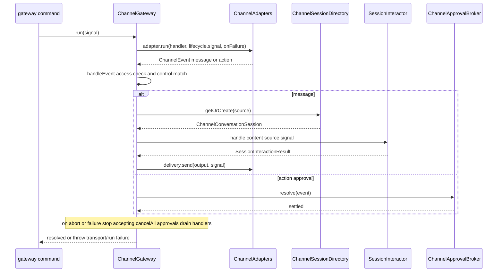

# Sonny channels and gateway

Sonny can run as a headless messaging agent alongside the interactive CLI. The `gateway` command starts one or more messaging **channels** (currently Telegram), each conversation is bound to a persisted agent session, tool approvals are routed back through the channel as inline buttons, and a `/new` control resets a conversation to a fresh session while preserving history. This page covers the channel domain, gateway orchestration, adapter contract, session binding, and remote approval. The shared input-ordering path that the gateway uses is documented in [channel gateway workflow](../workflows/channel-gateway-workflow.md); configuration lives in [configuration and operations](../operations/configuration.md).

## Why this exists

The CLI is an interactive, single-user surface. Channels expose the same agent runtime to external messaging platforms without a TUI: long-polling transports, persistent conversation identity, asynchronous tool approvals, and session reset on demand. The channel layer is deliberately separate from the CLI chat loop — it reuses `createAgentSession` and `AgentRuntime` but never touches `src/ui/*`.

## Domain contracts

`src/channels/channel.ts` defines the transport-independent vocabulary every adapter implements:

- `ChannelSource` — where an inbound event came from: `channel`, `conversationId`, `conversationKind` (`"direct" | "group" | "channel"`), `userId`, `messageId`, optional `threadId`.
- `ChannelTarget` — where to send output: `channel`, `conversationId`, optional `threadId`. `toChannelTarget(source)` strips user/message identity for replies.
- `ChannelEvent` — either `{ type: "message", source, text }` or `{ type: "action", source, value }`. Actions carry opaque values (approval buttons); messages carry user text.
- `ChannelOutput` — outbound payload: `target`, `text`, optional `replyToMessageId`, optional `actions` (inline buttons with `label`/`value`).
- `ChannelAdapter` — the transport seam: `run(handler, signal, onFailure?)` pumps inbound events to `handler` until the signal aborts or a fatal transport failure calls `onFailure`; `send(output, signal?)` delivers outbound text/actions.

`ChannelDelivery` (`src/channels/channel-delivery.ts`) is a thin router over the registered adapters: it looks up the adapter by `output.target.channel` and delegates `send`, rejecting unknown channels. Adapter names must be unique (enforced in the `ChannelDelivery` constructor). Delivery failures surface as `ChannelDeliveryError` (`src/channels/channel-errors.ts`).

`buildChannelPrompt(source)` (`src/channels/channel-prompt.ts`) appends a channel-aware context block to the system prompt for channel-originated turns — telling the model to keep responses to plain messaging text and never expose internal identifiers. It returns `""` for non-channel sources, so CLI turns are unaffected. `AgentSession.buildEffectiveSystemPrompt()` calls it as a contextual prompt section (see [architecture overview](../architecture/overview.md)).

## Gateway orchestration

`ChannelGateway` (`src/channels/channel-gateway.ts`) is the long-running orchestrator. `createChannelGateway()` (`src/channels/create-channel-gateway.ts`) assembles the whole graph from a single config snapshot:

1. Reads `config.channels.telegram`; if enabled, requires a `botToken` and builds a `TelegramAdapter`.
2. Throws if no channels are enabled.
3. Builds `ChannelDelivery(adapters)`.
4. Builds `ChannelApprovalBroker` wired to deliver through `ChannelDelivery`.
5. Builds `ChannelSessionBindingStore` at `<workspace>/.history/channels/bindings.json`.
6. Builds a channel command registry (`createChannelCommandRegistry()`, which includes the `/new` control).
7. Builds `ChannelSessionDirectory`, whose `createSession` factory calls `createAgentSession` with `approveToolCall` routed to `approvals.request(request)` — this is how tool permission requests reach the channel as inline buttons.
8. Builds `ChannelGateway` with an access check (`createChannelAccessCheck(config)`) that permits only configured Telegram user IDs.

### Lifecycle

`ChannelGateway.run(signal)` starts every adapter, forwards each inbound event to `handleEvent`, and guarantees orderly shutdown:



Key lifecycle invariants (see `ChannelGateway lifecycle` suite in `src/channels/channel-gateway.test.ts`):

- **Accepting gate** — once `stop()` fires (signal abort or transport failure), `accepting = false` and inbound events are ignored.
- **Transport failure wins** — a fatal adapter `onFailure` sets `transportFailure`, stops all adapters, and is re-thrown after cleanup even if a sibling adapter aborts.
- **Handler drain** — `run()` awaits all in-flight handlers and then `approvals.drain()` before resolving, so no approval delivery dangles.
- **One lifecycle per adapter** — `TelegramAdapter` throws if `run()` is called twice.

### Per-conversation serialization and generations

Each conversation (keyed by `createChannelSessionKey(source)`) has its own `ConversationState` with a `tail` promise and a `generation` (`{ abort, active, discarded }`). Messages chain on `tail` so a conversation's turns run in arrival order. Concurrent conversations are independent and can run in parallel ("serializes one conversation while another can run concurrently").

A **reset** (`/new`) retires the current generation: it aborts the retired generation's `AbortController`, cancels that conversation's pending approvals, creates a fresh `ConversationGeneration`, and only then runs `handleReset`. This means:

- An in-flight turn is interrupted (its reply is suppressed as obsolete).
- Queued messages from the old generation are discarded and counted; the reset confirmation reports "Discarded N queued messages".
- An old approval action cannot approve a replacement-session request (the broker cancels old approvals before the new session starts).
- Reset is serialized on the same `tail` as messages, so a reset waits for prior work to settle.

`ownConversationOperation` deletes the conversation state entry only if it is still the tail owner, so an older cleanup cannot clear ownership of newer queued work.

### Access control

`createChannelAccessCheck(config)` returns `(source) => boolean`. For `telegram`, it allows only user IDs in `config.channels.telegram.allowedUserIds`; every other channel and user is rejected before session acquisition or any output. The same access check is applied to **approval actions** ("applies the message access check to approval actions"), so a disallowed user cannot approve/deny a tool call.

## Session directory and binding store

`ChannelSessionDirectory` (`src/channels/channel-session-directory.ts`) maps each conversation to a live `ChannelConversationSession` (`{ sessionId, interactor }`) and deduplicates by both binding key and session ID:

- `getOrCreate(source)` returns the existing live session for a binding key, or acquires one. Acquisition checks the persisted binding first and resumes that session; otherwise it creates a new session and binds it.
- `replace(source, signal)` creates a fresh session (no resume), binds it, and forgets the old binding — used by `/new`. It preserves a shared old runtime if another binding still points at the previous session.
- `evict(sessionId)` drops a session from both maps (used when an interaction returns `exitRequested`).
- Simultaneous first interactions for the same binding collapse to one session creation and one binding write.

`ChannelSessionBindingStore` (`src/channels/channel-session-binding-store.ts`) persists conversation→session bindings as a JSON array at `<workspace>/.history/channels/bindings.json`:

- The binding **key** is `createChannelSessionKey(source)` = `channel:conversationKind:conversationId:threadId?` (URL-encoded parts). It uses routing identity only — **not** user or message identity — so the same direct conversation from the same user reuses one session regardless of message ID.
- Operations are serialized through a `tail` promise chain; writes are atomic (temp file + rename).
- The schema (`ChannelSessionBindingsSchema`) validates that each binding's `key` matches its routing fields and that keys are unique, so a corrupted or tampered file is rejected rather than treated as empty.
- Rebinding preserves `createdAt` and updates `sessionId`/`updatedAt`.

Resume safety: if a bound history session cannot be resumed, the directory throws a clear error ("Failed to resume the Sonny session referenced by a channel binding") and clears the failed acquisition so a later interaction can retry. If a binding resumes a *different* session ID than requested, it throws ("Channel binding resumed a different Sonny session than requested").

## Remote tool approval

`ChannelApprovalBroker` (`src/channels/channel-approval-broker.ts`) is the channel-side `PermissionHook`. When `createAgentSession` is wired by `createChannelGateway`, `approveToolCall` is `(request) => approvals.request(request)`. The broker:

1. Rejects non-channel requests immediately ("Remote approval is only available for channel-originated tool calls") without delivery.
2. Rejects already-aborted turns immediately.
3. Generates a UUID approval ID, renders a bounded preview via `describeToolApproval()` (`src/tools/tool-approval-description.ts`), and delivers it as a `ChannelOutput` with two inline actions: `approval:<id>:allow` and `approval:<id>:deny`.
4. Resolves when the user taps a button (an inbound `action` event matched by `approvalActionPattern`), a 5-minute timeout fires, the turn aborts, or delivery fails.

Resolution invariants (see `ChannelApprovalBroker` suite in `src/channels/channel-approval-broker.test.ts`):

- A resolving action must match the approval's `sourceKey` **and** `userId`; mismatched/unrelated/duplicate actions are consumed harmlessly or reported unhandled and cannot resolve the wrong turn.
- `cancelAll(reason)` and `cancelConversation(sourceKey, reason)` deny pending approvals; `drain()` waits for detached approval deliveries after cancellation so the gateway does not stop mid-send.
- Turn abort removes the abort listener exactly once and denies the pending approval with "Tool approval was cancelled because the turn ended."

The shared `describeToolApproval` renderer is the same description model the TUI uses for its approval pane, so the channel preview and the CLI preview stay consistent.

## Telegram adapter

`TelegramAdapter` (`src/channels/telegram/telegram-adapter.ts`) implements `ChannelAdapter` using grammY (`Bot` + `@grammyjs/runner` long-polling):

- **Update normalization** — registers `message:text` and `callback_query:data` filters only. Text messages are accepted only from `private` chats, from non-bot humans, with non-empty trimmed text; everything else is ignored. Callback queries are acknowledged (`answerCallbackQuery`) before gateway work, and acknowledgement failure does not block dispatch.
- **Routing** — `toTelegramSource` maps a private chat to `{ channel: "telegram", conversationKind: "direct", ... }`. `toTelegramCallbackSource` maps callback-backed messages to their original `conversationKind` so group/channel approval buttons route correctly.
- **Delivery** — `send()` splits text with `splitTelegramText` (`src/channels/telegram/telegram-text.ts`, default 4000-char Telegram limit, preferring paragraph → newline → whitespace boundaries, hard-split fallback). `replyToMessageId` and inline keyboard `actions` attach only to the first/last chunk respectively. Delivery failures are wrapped as `ChannelDeliveryError` without exposing the bot token.
- **Lifecycle** — `run()` starts the runner once (`hasRun` guard), tracks in-flight handlers, and on abort stops the runner and waits for active handlers. Polling/auth failure rejects `run()` and drains active work. Stop finishes an issued chunk but starts no later chunk.

`splitTelegramText` operates on Unicode code points (`Array.from(text)`), so oversized emoji/CJK text is chunked by character count, not byte count.

## Configuration

Channels are configured under the top-level `channels` key (`src/config/schemas/channels.schema.ts`):

```yaml
channels:
  telegram:
    enabled: true
    allowedUserIds:
      - "363571486"
```

- `enabled` defaults to `false`. When `true`, the schema requires a `botToken` and at least one `allowedUserId`.
- `botToken` is provided via the `TELEGRAM_BOT_TOKEN` environment override (`.env` or `process.env`), resolved by `loadConfig` → `parseConfig` alongside `LLM_API_KEY` and `TAVILY_API_KEY`. `.env.example` lists all three placeholders.
- `diffConfigSections` reports a `channels` change, but `channels` is **not** part of `createRuntimeConfigSignature()`, so a channel edit does not rebuild a live chat runtime. The gateway reads channel config at startup; the `gateway` command logs `channelConfiguration: "restart-required"`. Changing channels requires restarting the gateway process.

See [configuration and operations](../operations/configuration.md) for the full config store and env-override model.

## Extending the gateway

To add a new messaging channel adapter:

1. Implement `ChannelAdapter` (`src/channels/channel.ts`) — `name`, `run(handler, signal, onFailure?)`, `send(output, signal?)`. Emit normalized `ChannelEvent`s (`message` for text, `action` for button callbacks) with a `ChannelSource` whose `channel` matches `name`. Call `onFailure` on a fatal transport error before draining.
2. Register the adapter in `createChannelGateway()` (`src/channels/create-channel-gateway.ts`): read its config from `config.channels`, push it into `adapters`, and extend `createChannelAccessCheck` with the channel's allowlist logic.
3. Add a config schema under `src/config/schemas/channels.schema.ts` and include it in `ChannelsConfigSchema`; add env overrides in `src/config/load-config.ts` → `resolveOverrides` and `src/config/parse-config.ts` → `applyEnvOverrides` if the adapter needs a secret.
4. `ChannelDelivery` already routes by `output.target.channel`, so no delivery change is needed as long as adapter `name`s are unique.

Non-goals: the gateway reads channel config once at startup (it is outside `createRuntimeConfigSignature`), so a config edit does not rebuild a live runtime and requires restarting the gateway. Focused tests should follow the `TelegramAdapter` test structure (`src/channels/telegram/telegram-adapter.test.ts`: update normalization, callback actions, delivery chunking, lifecycle) and the `createChannelGateway` access-check tests (`src/channels/create-channel-gateway.test.ts`). Escalate to the `ChannelGateway lifecycle` suite if the adapter changes shutdown or fail-fast semantics.

## Source anchors

- `src/channels/channel.ts` — domain contracts (`ChannelSource`, `ChannelEvent`, `ChannelAdapter`, `ChannelOutput`, `toChannelTarget`)
- `src/channels/channel-delivery.ts` — `ChannelDelivery` adapter router
- `src/channels/channel-errors.ts` — `ChannelDeliveryError`
- `src/channels/channel-prompt.ts` — `buildChannelPrompt` channel-aware prompt section
- `src/channels/channel-gateway.ts` — `ChannelGateway` orchestration, conversation generations, reset
- `src/channels/create-channel-gateway.ts` — `createChannelGateway` graph assembly, `createChannelAccessCheck`
- `src/channels/channel-approval-broker.ts` — `ChannelApprovalBroker` remote approval
- `src/channels/channel-session-directory.ts` — `ChannelSessionDirectory` live + persisted session mapping
- `src/channels/channel-session-binding-store.ts` — `ChannelSessionBindingStore`, `createChannelSessionKey`
- `src/channels/telegram/telegram-adapter.ts` — `TelegramAdapter`
- `src/channels/telegram/telegram-text.ts` — `splitTelegramText` chunking
- `src/channels/index.ts` — barrel exports
- `src/tools/tool-approval-description.ts` — `describeToolApproval` shared approval preview
- `src/config/schemas/channels.schema.ts` — channel config schema