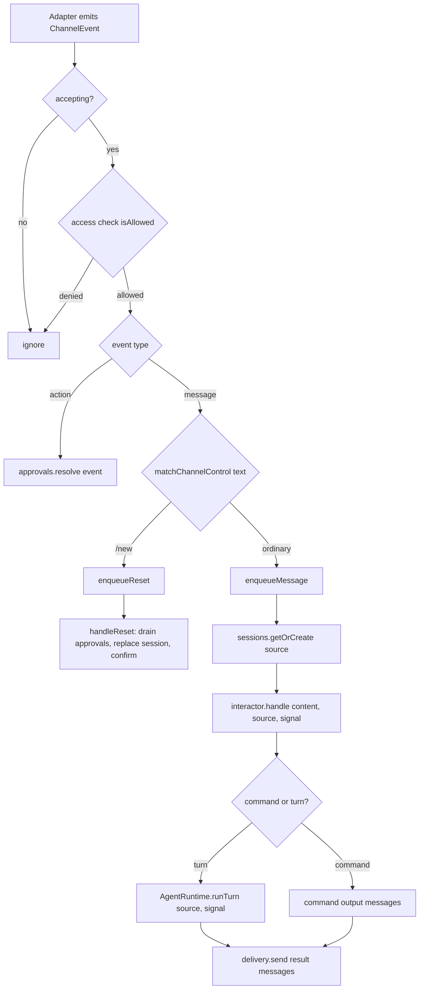

# Sonny channel gateway workflow

The `gateway` command runs Sonny as a headless messaging agent. Unlike the [chat and command workflow](chat-and-commands.md), there is no TUI: inbound messages arrive from messaging adapters, each conversation is bound to a persisted agent session, and tool approvals are answered through inline buttons. The channel domain, gateway orchestration, session binding, and remote approval are documented in [channels and gateway](../integrations/channels.md); this page covers the end-to-end input flow and the shared `SessionInteractor` that orders it.

## Entry points

- `index.ts` is the process entrypoint; `bun run index.ts gateway` (or `bun run gateway`) starts the gateway.
- `src/cli/main.ts` registers the `gateway` command alongside `chat` and delegates to `runGatewayCommand`.
- `src/cli/gateway-command.ts` — `runGatewayCommand` wires SIGINT/SIGTERM to an `AbortController`, constructs the gateway via `createChannelGateway`, and logs safe startup metadata (enabled channels, allowlist count, `restart-required` mode). On stop or failure it removes the signal listeners only after the gateway has drained.
- `src/channels/create-channel-gateway.ts` — `createChannelGateway` assembles adapters, delivery, approvals, bindings, the channel command registry, and the session directory into a `ChannelGateway`.

## Inbound message flow

1. The adapter emits a `ChannelEvent`. The gateway's `handleEvent` checks the `accepting` gate and the access check (`createChannelAccessCheck`), rejecting unauthorized input before any session acquisition or output.
2. `action` events are handed to `ChannelApprovalBroker.resolve` (see [channels and gateway](../integrations/channels.md#remote-tool-approval)).
3. `message` events are matched against channel-control commands via `commands.matchChannelControl(text)`. A `/new` (with no args) routes to `enqueueReset`; everything else routes to `enqueueMessage`.
4. `enqueueMessage` chains the operation on the conversation's `tail` (arrival order per conversation) and delegates to `handleMessage`.
5. `handleMessage` calls `sessions.getOrCreate(source)` to get the bound `ChannelConversationSession`, builds a `RuntimeSource` of kind `"channel"`, and calls `interactor.handle({ content, source, signal })`.
6. The `SessionInteractor` decides command-vs-turn (below) and returns `SessionInteractionResult.messages`.
7. The gateway delivers each result message through `ChannelDelivery.send`, replying to the original `messageId`. If an interaction returns `exitRequested`, the gateway evicts that conversation's session from the directory.

## SessionInteractor: the shared input path

`SessionInteractor` (`src/conversation/session-interactor.ts`) owns input ordering and command semantics shared by every non-TUI conversation surface. It serializes all input for one session through a `tail` promise chain — covering both synchronous commands and runtime turns — so a quick inspection cannot overtake an earlier user message.

`handle(input)` resolves as follows:

1. If the signal is already aborted before the queued operation starts, it resolves with `{ messages: [], exitRequested: false }` without running anything.
2. `handleNow` trims the content. If it starts with `/`, it dispatches through the `CommandRegistry` with a `SlashCommandContext` bound to the originating `RuntimeSource`.
3. If the command is handled, the result is mapped:
   - `message` → a `command` message.
   - `submit` → runs the submitted content as a turn, prepending any `notice`.
   - `alias` → re-dispatches the aliased input (capped at 5 resolutions to avoid loops).
   - `exit` → `exitRequested: true` (the gateway translates this to eviction, not process termination).
   - `channel-control` → forwarded as `result.channelControl` (the gateway matches `/new` earlier via `matchChannelControl`, so this path is reserved for future controls).
4. If it is not a command, it runs `AgentRuntime.runTurn({ content, source, signal })`.

The `SlashCommandContext` it builds is **source-aware**: `getContextUsage()` and `compactContext()` pass the originating `RuntimeSource` through to `AgentRuntime`, and `reloadConfiguration()` passes `{ force: true, source }`. This is why `AgentRuntime.getContextUsage(source)` and `compactContext({ source })` accept a source — so a channel-originated `/context` or `/compact` reports and operates under the channel source rather than the CLI default.

`SessionInteractor` is shared by both the CLI chat loop and the gateway (see [chat and command workflow](chat-and-commands.md)), giving channels the same deterministic command semantics without depending on `src/ui/*`. The two surfaces differ only in the approval hook they inject and the `RuntimeSource` they pass (`{ kind: "cli" }` vs `{ kind: "channel", ... }`).

## Session reset (`/new`)

`/new` (alias `/reset`) is a channel-only control registered by `createNewSessionCommand()` (`src/commands/builtin/new-session-command.ts`). Its `channelControl(args)` returns `"new-session"` only when called with no arguments; malformed arguments produce a usage message instead. The gateway matches this via `commands.matchChannelControl` before entering the runtime, so `/new` never starts a model turn.

`enqueueReset` (in [channels and gateway](../integrations/channels.md)) retires the current conversation generation, cancels its pending approvals, then `handleReset`:

1. Drains the retiring conversation's detached approval deliveries (`approvals.drainConversation(key)`).
2. Calls `sessions.replace(source, signal)` to create a fresh session and bind it.
3. Sends a confirmation: "Started a new session. Previous history is preserved." plus interruption/discard details.
4. On failure (and not aborted), sends a safe failure message; the previous session remains available.

If the gateway stops while a reset is waiting for old non-abortable work, the replacement and confirmation are prevented.

## Turn execution under a channel source

When `SessionInteractor` runs a turn, it calls `AgentRuntime.runTurn({ content, source, signal })` with `source.kind: "channel"`. That source flows through the `TurnContext` into:

- `AgentSession.buildEffectiveSystemPrompt(source)` — appends `buildChannelPrompt(source)` so the model responds in plain messaging text and hides internal identifiers.
- `ToolPermissionRequest.turn.source` — carried into `ChannelApprovalBroker.request`, which requires `source.kind === "channel"` and uses `source.userId` to scope approval actions.
- `getContextUsage(source)` / `compactContext({ source })` — source-aware reporting.

Tool execution, compaction, history persistence, and turn lifecycle events (`turn.started`/`turn.completed`/`turn.failed`/`turn.cancelled`) behave exactly as in the CLI path; see [architecture overview](../architecture/overview.md) and [context and history](../data/context-and-history.md). The gateway delivers assistant messages and notices back through the adapter; chunked delivery (Telegram) attaches `replyToMessageId` only to the first chunk and inline `actions` only to the last.

## Shutdown

`runGatewayCommand` aborts on SIGINT/SIGTERM. `ChannelGateway.run` then:

1. Sets `accepting = false` and aborts the lifecycle signal.
2. Calls `approvals.cancelAll("Gateway stopped.")` so pending approvals deny and unblock their turns.
3. Awaits all adapter runs (`Promise.allSettled`).
4. Drains in-flight handlers and then `approvals.drain()`.
5. Re-throws any transport or run failure.

The command removes its SIGINT/SIGTERM listeners only in `finally`, after the gateway has fully drained, so a slow shutdown cannot leave dangling signal handlers.

## Source anchors

- `index.ts`
- `src/cli/main.ts`
- `src/cli/gateway-command.ts`
- `src/channels/create-channel-gateway.ts`
- `src/channels/channel-gateway.ts`
- `src/conversation/session-interactor.ts`
- `src/conversation/index.ts`
- `src/commands/create-command-registry.ts`
- `src/commands/builtin/new-session-command.ts`
- `src/commands/command.ts`
- `src/commands/command-registry.ts`